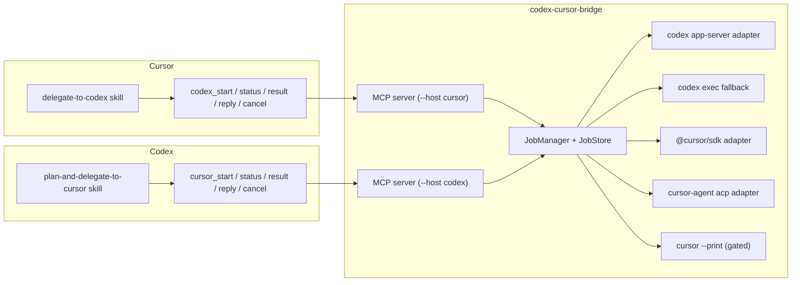

# codex-cursor-bridge

Local-first, two-way delegation between **Codex** and **Cursor** agents.

Delegate the hard stuff across editors without copy-pasting context between
apps: Cursor hands deep investigation, adversarial review, rescue, planning —
and even implementation — to Codex as background jobs; Codex hands validated
implementation plans to Cursor. A shared bridge keeps state, enforces
permissions, and preserves native session ids so you can always continue
where you left off.

> **Independent project.** This tool is not affiliated with, sponsored by, or
> endorsed by OpenAI or Cursor (Anysphere). "Codex" and "Cursor" are used
> solely to describe interoperability with those products.

## Why two host-specific plugins?

Cursor and Codex have different plugin manifests, different skills formats,
and — most importantly — **each side must only ever see the opposite host's
tools**. A single shared manifest would let a Cursor session call Cursor
delegation tools (or vice versa) and invite unbounded recursion. Two manifests
mean the tool surface itself enforces direction: the Cursor plugin can only
start Codex jobs; the Codex plugin can only start Cursor jobs.

## Architecture



Details in [docs/architecture.md](docs/architecture.md). Wire protocols in
[docs/protocol.md](docs/protocol.md).

## Trust & security model (short version)

- **Read-only by default.** Investigation/review/plan modes cannot modify
  your repo: Codex uses a read-only sandbox, and Cursor read-only jobs run
  in a disposable git worktree (writes fail the job). Implementation
  requires an explicit mode + write profile.
- **Isolated worktrees for writes.** Implementation jobs run in a temporary
  git worktree created from a recorded base ref. You get a patch artifact —
  nothing is merged automatically.
- **No shell, no network.** Agents are spawned with argument arrays, prompts
  via stdin; Codex runs with `networkAccess=false` by default. The bridge
  opens no ports and ships no telemetry.
- **Secrets stay put.** API keys are read by the CLIs/SDKs from your
  environment; the bridge never stores or logs them and redacts common
  secret shapes in everything it persists.
- **Recursion is capped.** Depth 1 by default (hard max 2), and prompts plus
  tool scoping forbid delegating back to the originating host.

Full threat model: [docs/security-model.md](docs/security-model.md).

## Requirements

- Node.js ≥ 20.19, npm ≥ 10, git ≥ 2.30
- `zip` is required for `npm run package` (release archives)
- For Cursor→Codex: the Codex CLI, installed and logged in
  (`npm i -g @openai/codex && codex login`)
- For Codex→Cursor, one of:
  - Cursor CLI + login (ACP; recommended, uses your existing Cursor auth).
    The official CLI is **not on npm** — install it with
    `curl https://cursor.com/install -fsS | bash` (Windows:
    `irm 'https://cursor.com/install?win32=true' | iex`), then `agent login`, or
  - `@cursor/sdk` + `CURSOR_API_KEY` (Cursor cloud agents; billing applies
    per Cursor's docs)
- OS: macOS, Linux, or Windows

Check everything at once:

```bash
codex-cursor-bridge doctor
```

## Installation for Cursor

Release archive (recommended):

1. Download `codex-cursor-bridge-cli-<ver>.zip` from GitHub Releases and
   unzip. Run `./install.sh` (`--dry-run` to preview; `install.ps1` on
   Windows). This puts the CLI in `~/.local/bin` (or
   `%LOCALAPPDATA%\Programs\codex-cursor-bridge`).
2. Download `codex-cursor-bridge-plugin-cursor-<ver>.zip` and unzip into
   `~/.cursor/plugins/local/codex-cursor-bridge` (install.sh from the CLI
   archive can do this too).
3. Restart Cursor. Run the `/setup-check` command or `codex-cursor-bridge
doctor`.

From source:

```bash
git clone https://github.com/surveyspark/codex-cursor-bridge.git
cd codex-cursor-bridge
npm ci && npm run build
ln -s "$PWD" ~/.cursor/plugins/local/codex-cursor-bridge
```

## Installation for Codex

1. Install the CLI as above (`install.sh` places it).
2. Copy/unzip `codex-cursor-bridge-plugin-codex-<ver>.zip` to
   `~/.codex/plugins/codex-cursor-bridge` (install.sh does this).
3. Verify: `codex-cursor-bridge doctor` and `codex plugin list`.

## First-run setup

```bash
codex-cursor-bridge doctor
```

- Fix every ✗ using the printed `→` remediation.
- Optional: create `~/.config/codex-cursor-bridge/config.json` (or
  `<repo>/.handoff/config.json`). Schema: `schemas/config.schema.json`.
  Show the effective config with `codex-cursor-bridge config show`.
  Precedence: defaults → user config → project config (untrusted keys
  ignored) → CLI flags → `CCB_*` environment variables.
- Environment: `CCB_STATE_DIR` (job/state root), `CCB_CODEX_BINARY`,
  `CCB_CURSOR_BINARY`, `CCB_DEBUG` (raises log level; does not dump raw
  protocol files), `CCB_BOOT_ID` (tests), `CCB_PARENT_JOB_ID` /
  `CCB_HANDOFF_DEPTH` (nested MCP floor). `--debug` sets
  `debugLogging` on the config.
- The bridge never modifies your global Cursor/Codex configuration.

## Authentication

| Who          | What                                                                                           |
| ------------ | ---------------------------------------------------------------------------------------------- |
| Codex        | `codex login` (ChatGPT) or `printenv OPENAI_API_KEY \| codex login --with-api-key`             |
| Cursor (ACP) | `agent login` — official CLI binary is `agent` (not on npm); uses your existing Cursor account |
| Cursor (SDK) | `CURSOR_API_KEY` in the environment (never logged by the bridge)                               |

Check readiness without leaking values: `codex-cursor-bridge doctor`.

## Quick start

### Cursor asks Codex to debug a hard bug

In Cursor, ask normally:

> The login flow fails when the session cookie expires mid-request. I've
> spent an hour on it. Delegate this to Codex.

The `delegate-to-codex` skill kicks in, picks `investigate`, and calls
`codex_start`. You'll see the **bridge job id** (`job_…`) and the **Codex
thread id**. CLI equivalent:

```bash
codex-cursor-bridge codex start \
  --mode investigate \
  --task "Login flow fails when the session cookie expires mid-request. Already tried: refreshing in middleware. Trace the root cause through src/auth/ and report." \
  --expected-output "root cause, evidence, 2-3 candidate fixes"
```

### Cursor asks Codex for an adversarial review

```bash
codex-cursor-bridge codex start --mode adversarial-review \
  --task "Break the new token refresh logic in src/auth/refresh.ts before we ship. Find races, replay windows, clock skew issues."
```

Or the `/adversarial-review-with-codex` command in Cursor.

### Cursor delegates implementation to Codex (isolated worktree)

```bash
codex-cursor-bridge codex start --mode implement \
  --task "Add GET /healthz returning {\"status\":\"ok\"} and a route test." \
  --constraints "only src/app.ts and test/routes.test.ts" \
  --expected-output "files changed, test outcome"
```

Codex runs in a fresh worktree; the result contains `changedFiles`,
`diffStat`, and a patch path like `.handoff/<job>.patch`. Apply it yourself:

```bash
git apply .handoff/<job>.patch
```

### Codex plans; Cursor executes

In Codex, ask:

> Plan a retry wrapper for fetchUser, then delegate execution to Cursor.

The `plan-and-delegate-to-cursor` skill inspects the repo, produces a
validated handoff plan (facts vs assumptions, steps, acceptance criteria,
allowed paths), and calls `cursor_start`. Monitor with `cursor_status`,
retrieve with `cursor_result`, review the diff, then apply the patch on your
confirmation.

### Check a background job

```bash
codex-cursor-bridge codex status  job_abc…    # state, native id, events
codex-cursor-bridge codex result  job_abc…    # summary, diffs, tests
codex-cursor-bridge cursor status job_def…
codex-cursor-bridge jobs list
```

MCP equivalents: `codex_status { jobId }`, `codex_result { jobId }`, etc.

### Reply to the same native session

```bash
codex-cursor-bridge codex reply job_abc… "Also check what happens when the clock is skewed by 5 minutes."
```

This continues the **same Codex thread** (via `thread/resume`) or the same
Cursor session (via `session/load`), with full prior context.

### Cancel a job

```bash
codex-cursor-bridge codex cancel job_abc…
```

Terminates the agent process tree (process group on POSIX, `taskkill /T` on
Windows) and records a `cancelled` result.

### Review Cursor's finished diff

`cursor_result` returns `changedFiles`, `diffStat`, and the patch path. In
Codex, ask "review what Cursor did" — the skill reads the patch, checks it
against the plan's acceptance criteria, and reports
`approved / approved-with-notes / changes-required` (one optional
auto-correction pass, disabled by default).

### Recovering after the editor closes

Job records survive restarts: `jobs list`, `jobs recover`. Native sessions
are continuable via `*_reply` (bridge) or `codex resume` / `cursor-agent
--resume <id>` (vendor CLIs). The bridge does not claim any particular
editor-history UI integration — resume works through these supported paths.

### No SDK key? Use ACP.

If `CURSOR_API_KEY` is unset, adapter selection falls back to
`cursor-agent acp` with your local Cursor login. `doctor` shows which adapter
would be chosen and why.

## Commands

| Command                                             | Purpose                                         |
| --------------------------------------------------- | ----------------------------------------------- |
| `doctor [--json]`                                   | Diagnose environment, adapters, auth (redacted) |
| `mcp --host cursor\|codex`                          | Run the host-scoped MCP stdio server            |
| `codex start\|status\|result\|reply\|cancel\|list`  | Codex job operations                            |
| `cursor start\|status\|result\|reply\|cancel\|list` | Cursor job operations                           |
| `jobs list\|clean\|recover`                         | Job maintenance                                 |
| `config show`                                       | Effective configuration (secrets redacted)      |
| `demos list\|run <name>`                            | Reproducible demos against fake agents          |

`codex start` flags: `--task`, `--mode`, `--profile`, `--model`, `--effort`,
`--base-ref`, `--timeout`, `--constraints`, `--expected-output`, `--json`,
`--allow-noninteractive-cli`, `--repo`.

## MCP tools

Cursor-facing (exposed to Cursor only): `codex_start`, `codex_status`,
`codex_result`, `codex_reply`, `codex_cancel`, `codex_list`.

Codex-facing (exposed to Codex only): `cursor_start`, `cursor_status`,
`cursor_result`, `cursor_reply`, `cursor_cancel`, `cursor_list`.

Strict JSON Schemas for inputs/outputs; no shell tool. Schemas live in
[`schemas/`](schemas/).

## Permission profiles

| Profile                    | Effect                                                                                                                                        | Default for                                      |
| -------------------------- | --------------------------------------------------------------------------------------------------------------------------------------------- | ------------------------------------------------ |
| `read-only`                | Agent cannot modify files (Codex read-only sandbox; Cursor jobs use a disposable worktree and fail if it is dirty; ACP write requests denied) | investigate / review / adversarial-review / plan |
| `isolated-workspace-write` | Writes inside a temporary git worktree; patch returned                                                                                        | implement                                        |
| `current-workspace-write`  | Writes to your current tree (your choice, warned when dirty)                                                                                  | —                                                |

## Worktree behavior

- Created from a verified base ref (explicit `--base-ref` > current branch >
  HEAD) under the state dir — never inside your repo.
- Branch: `bridge/<repo>-<jobshort>`. The bridge never merges, cherry-picks,
  or pushes.
- Result carries `worktree.path`, `branch`, `diffStat`, and a `.handoff/*.patch`
  artifact with apply instructions.
- Cleanup: explicit `git worktree remove` by you, or automatic after retention
  cleanup removes the job record.

## Job lifecycle

`queued → starting → running → completed | failed | cancelled | timed-out`

Approvals are auto-denied by design, so `waiting-for-approval` /
`waiting-for-input` are not used on the production path.

States, records, locking, retention, and crash recovery are documented in
[docs/architecture.md](docs/architecture.md).

## Resuming native sessions

- **Codex**: every job preserves the Codex **thread id** (UUIDv7).
  `codex_reply` resumes it via `thread/resume`; `codex resume` /
  `codex exec resume <id>` work on the CLI.
- **Cursor**: every job preserves the Cursor **session id**. `cursor_reply`
  re-attaches via ACP `session/load` when supported; `cursor-agent --resume
<id>` is the native path.

IDs are distinct on purpose:

| Identifier              | Example                           | Owner       |
| ----------------------- | --------------------------------- | ----------- |
| Bridge job id           | `job_9f2c…` (job\_ + 32 hex)      | this bridge |
| Codex thread/session id | UUIDv7                            | Codex       |
| Cursor agent/session id | opaque string                     | Cursor      |
| Worktree path / branch  | `<state>/worktrees/…`, `bridge/…` | git         |

## Applying generated changes

```bash
# inspect first
cat .handoff/<job>.patch
# then apply (never automatic)
git apply .handoff/<job>.patch
```

Or cherry-pick the worktree branch (`bridge/<repo>-<jobshort>`) after review.

## Troubleshooting

See [docs/troubleshooting.md](docs/troubleshooting.md) — covers auth
failures, adapter selection, stuck jobs, stale locks, recovery after crashes,
and plugin discovery.

## Uninstall

```bash
rm ~/.local/bin/codex-cursor-bridge            # or your --bin-dir
rm -rf ~/.cursor/plugins/local/codex-cursor-bridge
rm -rf ~/.codex/plugins/codex-cursor-bridge
# job state (optional): read stateRoot from `codex-cursor-bridge doctor --json`
```

Nothing else was modified: no global editor config, no shell rc files.

## Compatibility

| Component  | Minimum supported                   |
| ---------- | ----------------------------------- |
| Node.js    | 20.19                               |
| Codex CLI  | 0.145.0 (app-server protocol)       |
| Cursor CLI | 1.0.x (documentation/fakes only)    |
| OS         | macOS (tested), Linux, Windows (CI) |

Full matrix, verification status, and documented deviations:
[docs/compatibility.md](docs/compatibility.md).

## Limitations

- Credential-dependent end-to-end runs (real Codex/Cursor API calls) are
  opt-in (`RUN_CODEX_E2E=1`, `RUN_CURSOR_E2E=1`) and were not executed for
  this release unless stated in the release notes; all protocol behavior is
  tested against fake agents implementing the official schemas.
- `cursor-agent` and `@cursor/sdk` evolve; the SDK adapter fails gracefully
  (falls back to ACP) when its surface changes.
- The optional post-execution Codex review is one read-only pass; auto-
  correction is a single follow-up, disabled by default.

## Development

```bash
npm ci
npm run build       # tsc project references + esbuild bundle
npm run lint        # eslint
npm run format      # prettier
npm test            # vitest: unit, protocol, contract, integration, security
npm run validate:manifests
npm run package     # release archives + SBOM + checksums
npm run demos       # end-to-end demos against fake agents
```

Layout: `packages/*` (bridge-core, job-store, adapters, orchestrator,
mcp-server, cli, test-support), `plugins/*`, `schemas/`, `docs/`, `tests/`.

## Release

See [docs/release.md](docs/release.md). Releases ship prebuilt bundles and
plugin archives; no build step is required for users.

## License & trademark notice

Apache-2.0 — see [LICENSE](LICENSE) and [NOTICE](NOTICE). This project is
independent and not affiliated with, sponsored by, or endorsed by OpenAI or
Cursor (Anysphere). Product names are used only for descriptive
interoperability. No vendor logos are used.
