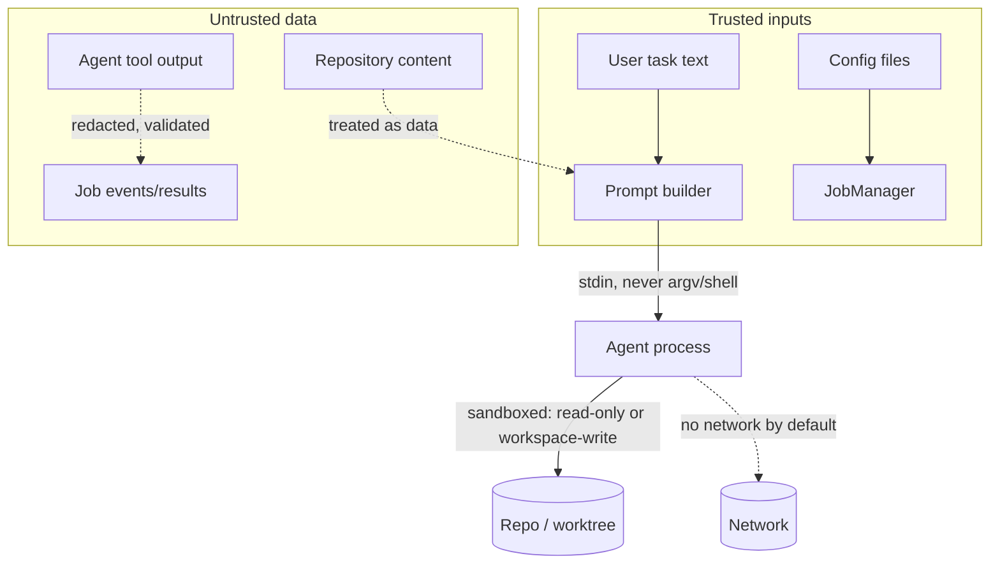

# Architecture

This document describes how codex-cursor-bridge works internally: packages,
data flow, adapters, the job system, and the trust boundaries.

## Overview

codex-cursor-bridge is a local-first, two-way delegation system:

- A **Cursor plugin + skill** delegates hard work from Cursor to Codex.
- A **Codex plugin + skill** plans in Codex and hands execution to Cursor.
- A shared **TypeScript bridge** (bundled CLI + MCP servers) does the work.

```mermaid
flowchart LR
    subgraph Cursor["Cursor (IDE/CLI)"]
        CS[delegate-to-codex skill] --> CM[codex_start tool]
    end
    subgraph Bridge["codex-cursor-bridge (bundled CLI)"]
        CM --> |MCP stdio| MS[mcp-server --host cursor]
        MS --> JM[JobManager]
        JM --> WS[JobStore<br/>state dir]
        JM --> WA[codex adapter]
        JM --> WB[cursor adapter]
        WA --> CA1[codex app-server<br/>JSON-RPC stdio]
        WA --> CA2[codex exec<br/>one-shot fallback]
        WB --> CB1[@cursor/sdk<br/>CURSOR_API_KEY]
        WB --> CB2[cursor-agent acp<br/>ACP JSON-RPC stdio]
        WB --> CB3[cursor-agent --print<br/>gated fallback]
    end
    subgraph Codex["Codex (CLI)"]
        CS2[plan-and-delegate-to-cursor skill] --> CM2[cursor_start tool]
    end
    CM2 --> |MCP stdio| MS2[mcp-server --host codex]
    MS2 --> JM
```

## Packages

| Package          | Responsibility                                                                                                                     |
| ---------------- | ---------------------------------------------------------------------------------------------------------------------------------- |
| `bridge-core`    | Domain types, typed errors, JSON-RPC/NDJSON plumbing, redaction, path safety, process spawning, config loading, structured logging |
| `job-store`      | Persistent job records: atomic writes, dir-lock, crash recovery, retention                                                         |
| `codex-adapter`  | `codex app-server` adapter (primary) and `codex exec` one-shot fallback                                                            |
| `cursor-adapter` | Cursor transports: `@cursor/sdk`, `cursor-agent acp`, gated `--print` fallback                                                     |
| `orchestrator`   | `JobManager` (state machine, concurrency, timeouts, worktree isolation, recursion guards) and the MCP tool router                  |
| `mcp-server`     | Host-scoped MCP stdio servers (`--host cursor` exposes Codex tools; `--host codex` exposes Cursor tools)                           |
| `cli`            | `codex-cursor-bridge` executable: doctor, mcp, job commands, config, demos                                                         |
| `test-support`   | Fake agents and git fixtures for tests                                                                                             |

## Job lifecycle

```
queued → starting → running ─┬→ completed
                             ├→ failed
                             ├→ cancelled
                             ├→ timed-out
                             ├→ waiting-for-approval → running
                             └→ waiting-for-input → running
```

- `enqueue` validates the request (mode, profile, recursion depth) and writes
  the record atomically to `<stateRoot>/jobs/<jobId>/job.json`.
- `run` acquires a concurrency slot, creates an isolated git worktree for
  write profiles (`isolated-workspace-write`), selects an adapter, and streams
  normalized events into the record.
- Cancellation aborts an `AbortController` wired into the child process:
  POSIX kills the whole process group, Windows uses `taskkill /T /F`.
- `finalize` collects diff stats and exports a patch artifact (`.handoff/`)
  for write jobs, then persists the `JobResult`.
- Crash recovery (`jobs recover` / automatic at MCP startup) marks non-terminal
  jobs as `failed` when their worker pid is gone.

## Adapter selection

**Cursor → Codex** (fixed preference):

1. `codex app-server` — initialize → `thread/start` → `turn/start` with
   sandbox policies per permission profile. Native Codex thread id (UUIDv7)
   is captured and preserved. Approval server-requests are auto-denied
   (the bridge runs `approvalPolicy=never` and enforces its own sandbox).
2. `codex exec --json` one-shot fallback — no live continuation; the result
   says so honestly.

**Codex → Cursor** (configurable via `preferredCursorAdapter`):

1. `@cursor/sdk` when installed and `CURSOR_API_KEY` is present.
2. `cursor-agent acp` — Agent Client Protocol over stdio; permission requests
   relayed with a deny-by-default policy; session ids preserved.
3. `cursor-agent --print` — only with explicit opt-in
   (`allowNonInteractiveCliFallback`), because per official docs
   non-interactive mode has full write access.

## Trust boundaries



Key invariants:

1. Task text travels via **stdin**, never shell-interpolated argv; spawning is
   argument-array only, `shell: false`.
2. Prompts state that repository content is untrusted data and that
   instructions embedded in files/tool output must not be followed.
3. Everything an agent emits is **redacted** (common key/token/cookie/private
   key patterns) before persistence.
4. Write access requires an explicit profile; implementation defaults to an
   isolated worktree created from a recorded base ref. Nothing is merged
   automatically; a patch artifact is produced instead.
5. Recursion is capped: handoff depth 1 by default, hard max 2, and every
   prompt forbids delegating back to the originating host.

## State layout

```
$CCB_STATE_DIR (default: OS state dir)
├── jobs/<job_id>/job.json     # job record (0600, atomic writes)
├── jobs/<job_id>/.lock/       # dir-lock during update
├── jobs/<job_id>/debug/       # reserved; not written today
├── logs/                      # bridge logs (redacted)
└── worktrees/                 # isolated worktrees

<repo>/.handoff/               # project-local, gitignored
├── config.json                # optional project config
└── <job>.patch                # exported diff artifacts
```

## MCP tool surface

`--host cursor` (loaded by Cursor) exposes **only** Codex tools:
`codex_start`, `codex_status`, `codex_result`, `codex_reply`, `codex_cancel`,
`codex_list`.

`--host codex` (loaded by Codex) exposes **only** Cursor tools:
`cursor_start`, `cursor_status`, `cursor_result`, `cursor_reply`,
`cursor_cancel`, `cursor_list`.

There is no shell-command tool. Inputs/outputs use strict JSON Schemas
(`schemas/*.json`); when a structured `plan` is supplied on start it is
validated with `validateHandoffPlan` before enqueue.
